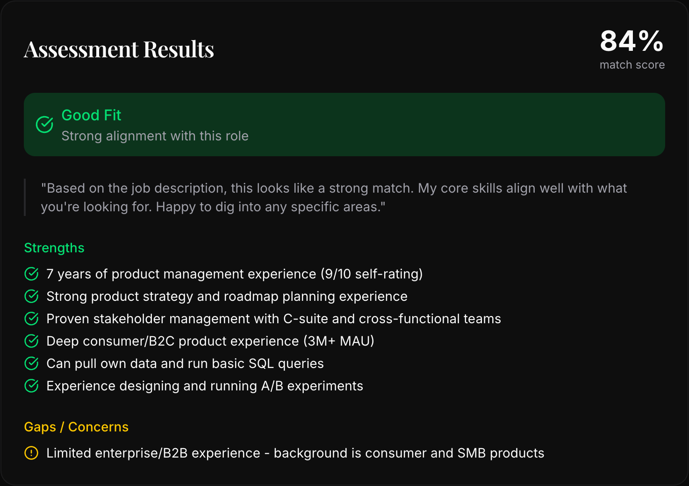

# AI Resume

A candidacy portfolio platform for software engineers who value honesty and transparency. Present your skills, experience, and realistic career expectations to employers - including what you *can't* do yet.


## Philosophy

Most portfolios oversell. FenrirAI takes a different approach: **radical transparency**. It helps you present an authentic picture of your abilities, skill gaps, and career preferences. The result? Better job fits and employers who appreciate honesty.

## Features

### Public Portfolio
- **Hero Section** - Professional intro with availability status, past employer badges, and call-to-action
- **Experience Timeline** - Work history with "AI Context" containing honest insights (why you joined/left, challenges faced, lessons learned)
- **Skills Matrix** - Categorized by strength level:
  - **Strong** (7-10): Ready to hit the ground running
  - **Moderate** (5-6): Competent with some ramp-up
  - **Growth** (1-4): Learning or want to learn
- **AI Chat** - "Ask AI About Me" answers tough interview questions based on your self-reported data
- **JD Analyzer** - Paste a job description, get an honest fit assessment with strengths and gaps



### Admin Panel
Full content management for your portfolio:
- Profile (name, elevator pitch, job preferences, availability)
- Experience (positions, achievements, honest context)
- Skills (ratings, evidence, notes)
- Gaps (known weaknesses, learning interest)
- FAQs (preloaded AI responses)

## Tech Stack

| Category | Technology |
|----------|------------|
| Framework | React 19, TypeScript |
| Build | Vite, Bun |
| Backend | Supabase (Postgres, Auth, Edge Functions) |
| State | TanStack Query |
| Forms | React Hook Form + Zod |
| Styling | Tailwind CSS v4, Framer Motion |
| UI | shadcn/ui (Radix primitives) |
| Routing | React Router DOM v7 |

## Getting Started

### Prerequisites
- [Bun](https://bun.sh/) (or npm/pnpm)
- Supabase account (optional - demo mode works without it)

### Installation

```bash
# Clone the repo
git clone https://github.com/yourusername/fenrirai.git
cd fenrirai

# Install dependencies
bun install

# Start development server
bun run dev
```

### Environment Variables

Create a `.env.local` file:

```env
VITE_SUPABASE_URL=your_supabase_url
VITE_SUPABASE_ANON_KEY=your_supabase_anon_key
```

**No Supabase?** The app runs in demo mode with realistic placeholder data and keyword-based AI responses.

### Build for Production

```bash
bun run build
```

Output goes to `dist/`. Deploy to Vercel, Netlify, or any static host.

## Project Structure

```
src/
├── components/
│   ├── ui/           # shadcn/ui components (button, card, input...)
│   ├── layout/       # Layout, Footer
│   ├── sections/     # Hero, Experience, Skills, JDAnalyzer
│   ├── chat/         # ChatDrawer
│   └── admin/        # AdminLayout, ProtectedRoute
├── pages/
│   ├── Home.tsx      # Main portfolio page
│   └── admin/        # Login, Profile, Skills, Experience...
├── hooks/            # Data fetching + auth hooks
├── lib/              # Supabase client, utilities
└── types/            # TypeScript definitions
```

## Demo Mode

When Supabase credentials are missing, the app automatically:
- Returns realistic placeholder data
- Uses keyword matching for chat responses
- Detects skill keywords in JD analysis
- Enables full admin panel functionality (local state)

This makes development and testing seamless without a backend.

## Deployment

Configured for Vercel in `vercel.json`:
- Build command: `bun run build`
- Output: `dist/`
- SPA rewrites enabled for client-side routing

## Acknowledgments

This template is based on the original work by [Nate B. Jones](https://www.natebjones.com/). Thank you for providing the foundation that made this project possible.

## License

MIT
